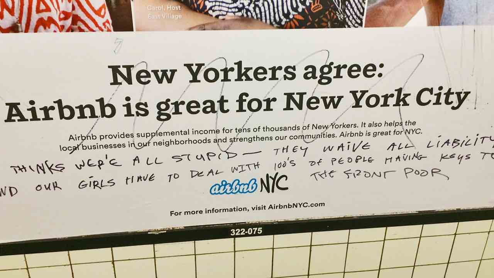

**Three key insights on Uber, when to drop out, and valuations from Communitech's fireside chat with renowned VC Fred & CEO Ted.**

<strong>Woah who's Fred & Ted?!</strong> Fred Wilson is a very well known Venture Capitalist and Co-Founder of <a href="https://www.usv.com" target="_blank">Union Square Ventures</a> (funded Twitter, Tumblr, Etsy, Kik...). Ted Livingston is Founder/CEO of <a href="http://www.kik.com" target="_blank">Kik</a>, currently the messaging app of choice for over 200 million people. As an early investor in Kik, Fred & Ted have built a strong working relationship and it was remarkable to have both of them sit down to share their perspective with a chat moderated by <a href="http://velocity.uwaterloo.ca" target="_blank">Velocity</a> Director Mike Kirkup. Three parts of the chat stood out for me.

<h2>Disruption is Delusional</h2>
Anybody reading the news over the past two years has seen the controversies as a result of two companies disrupting the transportation and accommodation sectors respectively: <strong>Uber & Airbnb. </strong>

From most recently a <a href="http://www.theglobeandmail.com/news/alberta/calgary-home-in-ruins-after-airbnb-nightmare/article24182387" target="_blank">"drug-induced orgy" at an Airbnb in Calgary</a> to an <a href="http://valleywag.gawker.com/uber-calls-womans-20-mile-nightmare-abduction-an-ineff-1645819700" target="_blank">Uber driver kidnapping a woman</a>, entire sites have sprung up devoted to frightening tales including <a href="http://www.airbnbhell.com/airbnb-guest-stories" target="_blank">airbnbHell</a> and <a href="http://www.ubertrocity.com/top-10-uber-horror-stories" target="_blank">UberTrocity</a>. These companies have tried to combat horror stories with self-justifying <a href="http://pando.com/2012/10/24/travis-shrugged/?utm_content=buffera9b1c&utm_medium=social&utm_source=twitter.com&utm_campaign=buffer" target="_blank">Ayn Rand philosophies</a> instilled into employees and <a href="http://www.theverge.com/2014/7/14/5896785/hey-new-york-airbnb-wants-to-get-you-in-bed" target="_blank"> persuasive marketing campaigns</a> to the public.

When asked about his thoughts on these companies, Fred didn't let them off the hook:

> "There are things that Airbnb has facilitated that aren't good things. I'm not an investor in them so I can admit it. [...] I think the same thing is true for some ride sharing services. [...] We ought to admit it's not a good thing. We ought to start to have a conversation with people about how we can put the proper controls in place so that these services are used in ways that are helpful, and are not used in ways that are harmful."

And yet despite the horrific situations that users have found themselves in, the <a href="http://upstart.bizjournals.com/entrepreneurs/hot-shots/2014/11/05/travis-kalanicks-take-no-prisoners-startup.html?page=all" target="_blank">companies</a> <a href="http://www.bloomberg.com/bw/articles/2014-02-20/uber-leads-taxi-industry-disruption-amid-fight-for-riders-drivers" target="_blank">claim</a> that this is simply the price of <em>disruption</em>. I have used both services and they indeed are radically better than their "old economy" equivalents. It can become easy to justify the horrific experiences of some users as simply an unfortunate <em>cost of doing business</em> in the shared economy. Yet, Fred wasn't silent on the valley culture of <em>disruption</em> worship:

> "I don't like when people in my business or in the startup sector are blindly like 'We're disruptors!' 'Screw those people, we're making the world better!' and 'Get off our back'. It's not really true. There's always some harm when you build something new and it does, I think, make sense to have a conversation about what the rules of the game should be to make sure that things are safe and things are done properly."

Fred's remarks struck a chord with me in his balanced approach to the need for <strong>reasonable yet protective</strong> regulation in the new sharing economy.

<h2>Don't Choose to Drop Out, Wait for the Startup to Force You</h2>
A question that was brought up by Velocity Director Mike Kirkup and that echoes frequently in the minds of student entrepreneurs is <strong>"how do I know if I should drop out?"</strong>. We asked ourselves this a lot prior to pulling the plug and <a href="/2014/10/the-389-day-laurier-bba/">deferring classes</a> in Fall 2014.

Unlike many entrepreneurs (myself included) who sometimes seem like they're looking for a reason to drop out, Ted stayed in school as long as he could. <strong>He didn't drop out of University of Waterloo until Kik was raising a \$1 million seed funding round.</strong> At that point, his investors wouldn't sign unless he dropped out to work full time.

He and Mike chimed in about the world leading talent pool at University of Waterloo and opportunities to do startups without giving up the safety net of university. All three on stage reiterated that you shouldn't start a startup to simply start a startup, wait for the right idea and work at other startups until then.

Having gone through many of these realizations over <a href="/blog/lessons-from-behind-the-curtain/">my journey with Teknically</a>, I couldn't agree more with the panel:

> 1. Don't drop out until you absolutely have to.
> 2. Don't start a startup just to start a startup.
> 3. Don't take for granted the safety net of being a university student, make the most of it!

<h2>Let the Valuation Choose You</h2>
In the last few minutes of the talk, Fred was asked about how to choose an initial valuation for fundraising rounds. He proceeded to dish out one of the simplest mathematical methods I've heard. (If the following section seems a bit confusing, try this <a href="https://youtu.be/EHzvmyMJEK4" target="_blank">How to Start a Startup lecture</a>, if it seems too simple check out the book <a href="http://www.amazon.com/exec/obidos/ASIN/0470929820/domofa-20" target="_blank">Venture Deals</a> by Brad Feld)

Most entrepreneurs initially want to optimize for a high valuation when raising money. This mentality stems from the desire to give less of their company away for the same amount of money. Fred reiterated that this is optimizing for the wrong thing. Instead of simply of choosing a big valuation and trying to justify it, he suggested to focus on three more important areas to easily determine a reasonable valuation.

1. <strong>How much do you want to give away?</strong> Each round plan to give 10-20% of the company away, but don't go too much over 20% or later rounds will become very difficult.
2. <strong>How much do you need?</strong> At least 12 months of runway. More than 18 may make the round difficult to raise and harder for next one.
3. <strong>Choose the right investors.</strong> At the end of the day who your investors are matter more than valuation, you'll be married to them most likely for the lifespan of the company.

> Calculate your valuation simply:  Valuation = 12-18 month burn / 10-20% equity

<h3>Example A</h3>
<strong>Raising (burn)</strong> $20,000 x 12 months = $240,000 <strong>for (equity)</strong> 10-20%.
<strong>Valuation</strong> = $240,000 / 0.2 to $240,000/0.1 = $1.2 million to $2.4 million

<h3>Example B</h3>
<strong>Raising</strong> $50,000 x 18 months = $900,000 <strong>for</strong> 15%
<strong>Valuation</strong> = $900,000 / 0.15 = $6 million

Fred's simple math makes choosing a ballpark valuation almost too easy. We now have no excuse for getting sucked into an valuation inflation spiral (I'm looking at you <a href="https://youtu.be/a9ToqUSfkv8" target="_blank">Silicon Valley</a> Season 2 Episode 1)!

<h2>Last Words</h2>
Fireside Chats = Free learning from legends (usually worth the hype, don't let doubts stop you from showing up!)
